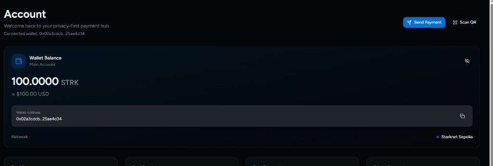
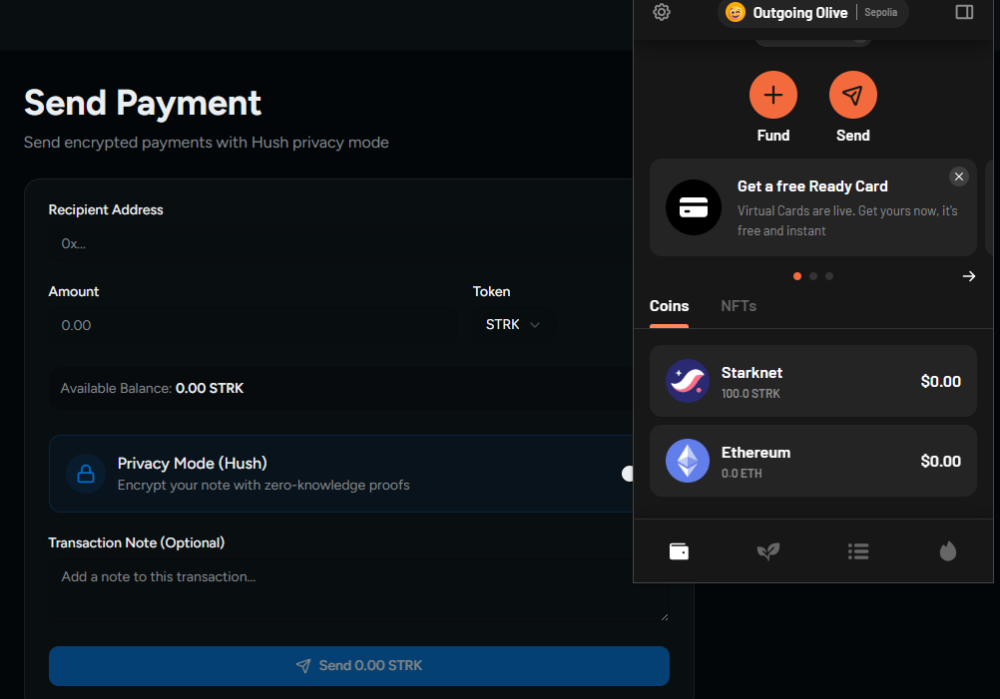
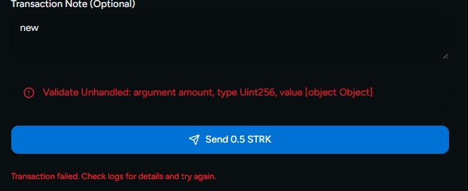

# Hush - Privacy-First Payments on Starknet

Hush is a privacy-focused payment hub on Starknet Sepolia. It supports STRK transfers, optional encrypted transaction notes, and transaction lifecycle tracking with confirmation polling.

## Overview

Public blockchains make payment metadata easy to inspect. Hush improves payment UX by adding privacy-oriented note handling while keeping wallet and transfer flows familiar.

Core goals:

- send STRK with a clean wallet UX
- attach optional private notes
- let recipients read notes intended for them
- keep transfer state explicit (`pending`, `success`, `failure`)

## Implemented Features

### Wallet and Transfer Core

- Starknet wallet connect (Argent + Braavos)
- Sepolia STRK balance display
- STRK send flow with lifecycle state machine
- confirmation polling and success modal
- RPC fallback strategy for balance/tx status reliability

### Privacy Notes MVP

- privacy toggle on send flow
- encrypted note payload creation on send
- shared encrypted message storage via API
- recipient inbox section with local decryption

## Tech Stack

- Next.js App Router
- TypeScript
- `@starknet-react/core`
- Starknet.js
- Browser Web Crypto API

## Architecture

### Client

- `components/starknet-provider.tsx` - Starknet config/provider
- `components/wallet-header.tsx` - wallet connect + encryption identity bootstrap
- `hooks/useTokenBalance.ts` - STRK balance read with fallback providers
- `hooks/useSendStrk.ts` - STRK transfer + lifecycle confirmation
- `app/send/page.tsx` - send form + encryption flow
- `app/transactions/page.tsx` - transaction list + private recipient inbox

### Privacy Layer

- `lib/privacy.ts`
  - generates/loads local encryption identity
  - registers wallet public key
  - encrypts/decrypts notes
  - calls privacy APIs

- `lib/privacy-store.ts`
  - file-backed key/message store for local development (`data/privacy-store.json`)

### API Layer

- `POST /api/privacy/register-key`
  - body: `{ address, publicKeyJwk }`
- `GET /api/privacy/public-key/[address]`
  - returns recipient public key
- `POST /api/privacy/messages`
  - body: `{ txHash, payload, createdAt }`
- `GET /api/privacy/messages?recipient=<address>`
  - returns encrypted notes addressed to recipient

## Encrypted Note Delivery Flow

1. User connects wallet.
2. App ensures encryption identity exists and public key is registered.
3. Sender enables Privacy Mode and enters note.
4. Sender encrypts note for recipient and submits STRK transaction.
5. On success, encrypted payload is stored with tx hash.
6. Recipient opens transactions page.
7. App loads encrypted notes for recipient address and decrypts locally.
8. Recipient sees plaintext note in **Private Messages For You**.

## Local Dev Setup

1. Install deps:
   - `npm install`
2. Run:
   - `npm run dev`
3. Open:
   - `http://localhost:3000`

## Testing Guide

### Wallet + Balance

1. Connect wallet (Argent or Braavos) on Sepolia.
2. Confirm STRK balance appears on dashboard and send page.

### STRK Transfer Lifecycle

1. Open `/send`.
2. Enter recipient + amount.
3. Confirm wallet popup.
4. Verify send transitions to confirmed state and success modal.

### Private Note End-to-End

1. Connect recipient wallet once (registers key).
2. Connect sender wallet.
3. In `/send`, enable Privacy Mode and add note.
4. Send STRK and confirm.
5. Switch to recipient wallet.
6. Open `/transactions`.
7. Verify decrypted note appears in **Private Messages For You**.

## Screenshots

### Dashboard STRK Balance

### Send Flow

### Transfer Validation Error (resolved during implementation)

## Notes

- `data/privacy-store.json` is ignored by git and used only for local/dev persistence.
- This is an MVP privacy delivery implementation. For production, use a proper database, authentication, and stronger key management/signing guarantees.

<<<<<<< HEAD
# Hush — Privacy-First Payments on Starknet

Hush is a privacy-first payment hub built on Starknet that enables users to send encrypted payments, attach private transaction notes, and prepare for advanced shielded payment flows using zero-knowledge infrastructure.

Unlike traditional wallets that expose transaction metadata, Hush introduces privacy-native payment experiences while preserving Starknet’s scalability and composability.

---

## 🚀 Problem

Blockchain payments are transparent by default:

• Transaction notes are public
• Payment intent can be exposed
• Sender-receiver relationships are traceable
• Privacy tooling is fragmented and complex

This creates friction for everyday payments, invoices, and merchant interactions.

---

## 💡 Solution

Hush provides a privacy-first payment layer that combines wallet functionality with encrypted metadata and upcoming shielded payment primitives.

Users can:

• Send STRK payments securely
• Attach encrypted transaction notes
• Track lifecycle-aware transactions
• Prepare for stealth and shielded payment flows

---

## ✨ Features

### Wallet Core

• Starknet wallet connection (Argent + Braavos)
• STRK balance indexing with RPC fallback
• Transaction lifecycle state machine
• Confirmation polling and success modal

### Privacy Layer (MVP)

• Encrypted transaction notes
• Shared key derivation for sender/receiver
• Privacy toggle UX
• Metadata privacy without breaking transfer execution

### Infrastructure

• Multi-RPC resilience
• Uint256 safe transfer engine
• Lifecycle-aware transfer orchestration
• Balance auto-refresh after confirmation

---

## 🧠 Architecture Overview

Hush is structured in layered phases:

**Wallet Layer**
• Connection
• Balance indexing
• Transfer execution
• Lifecycle state tracking

**Privacy Layer**
• Encrypted notes (MVP)
• Receiver note discovery (upcoming)
• Stealth payments (planned)

**Protocol Layer**
• Shielded pool contracts
• Nullifier logic
• Commitment trees
• zk proof verification

---

## 🛠 Tech Stack

• Starknet
• Next.js App Router
• starknet-react
• Zustand state management
• AES-GCM encryption (client-side)
• Multi-RPC provider architecture
• TypeScript

---

## 🧪 Demo Flow

1. Connect wallet
2. View STRK balance
3. Send payment
4. Enable Privacy Mode
5. Attach encrypted transaction note
6. Confirm lifecycle completion

---

## 🔮 Roadmap

• Transaction history indexing
• Receiver encrypted note scanning
• Stealth payment protocol
• Shielded payment pool (Cairo)
• zk proof integration
• Merchant privacy payments
• Relayer infrastructure

---

## 🏁 Hackathon Context

Hush is built as a privacy-native payment hub for Starknet, combining wallet UX with cryptographic privacy primitives to enable real-world private payment experiences.

---

## 📌 Status

MVP in active development with encrypted metadata privacy and lifecycle-aware STRK transfers completed.

---

## 📄 License

MIT

=======
# Hush Starknet

Private payments with private notes on Starknet Sepolia.

Hush is a privacy-first payment app that lets users send STRK transfers with optional encrypted transaction notes. It includes wallet connection, transaction lifecycle state handling, and recipient-side decryption for private notes.

## What Was Added

- Starknet wallet connection using `@starknet-react` (Argent / Braavos).
- STRK balance fetching with Sepolia RPC fallback.
- STRK send flow with transaction lifecycle (`pending`, `success`, `failure`) and confirmation polling.
- Private note encryption/decryption flow wired into send and transactions UI.
- Shared message/key API routes for recipient-readable encrypted notes.

## Network and Wallet

- Network: **Starknet Sepolia**
- Wallets: **Argent / Braavos**
- Provider: JSON-RPC (with fallback for resilient reads in hooks)

## Project Structure (Relevant Parts)

- `components/starknet-provider.tsx` - Starknet config and provider setup.
- `components/wallet-header.tsx` - Connect wallet UI + encryption identity initialization.
- `hooks/useTokenBalance.ts` - STRK balance reads with RPC fallback.
- `hooks/useSendStrk.ts` - STRK transfer execution + lifecycle confirmation polling.
- `app/send/page.tsx` - Send UI, private note encryption, transaction success modal flow.
- `app/transactions/page.tsx` - Transaction list + recipient private message inbox.
- `lib/privacy.ts` - Key management, encryption/decryption, message API client.
- `lib/privacy-store.ts` - local file-backed storage model for keys/messages.
- `app/api/privacy/*` - privacy key + encrypted message endpoints.

## Encrypted Note Delivery (How It Works)

1. User connects wallet.
2. App ensures encryption identity exists for that wallet and registers the public key.
3. Sender enables Privacy Mode and writes a note.
4. Note is encrypted for the recipient (using recipient registered public key).
5. STRK transaction is sent and confirmed.
6. Encrypted payload is stored through the privacy API with the tx hash.
7. Recipient opens transactions page; app fetches encrypted notes for recipient address.
8. Recipient decrypts locally with their private key and sees plaintext.

## API Endpoints

- `POST /api/privacy/register-key`
  - Body: `{ address, publicKeyJwk }`
- `GET /api/privacy/public-key/[address]`
  - Returns registered public key for wallet address.
- `POST /api/privacy/messages`
  - Body: `{ txHash, payload, createdAt }`
- `GET /api/privacy/messages?recipient=<address>`
  - Returns encrypted messages addressed to recipient.

## Local Storage and Data

- Client encryption keys are stored in browser local storage (per wallet).
- Shared encrypted messages + key registry are persisted in:
  - `data/privacy-store.json`

> This is an MVP storage model suitable for local/dev usage. For production, replace with a real database + auth/signature validation.

## Setup

1. Install dependencies:
   - `npm install`
2. Start app:
   - `npm run dev`
3. Open:
   - `http://localhost:3000`

## How to Test

### A) Wallet + balance

1. Connect wallet (Argent or Braavos) on Sepolia.
2. Verify STRK balance appears on dashboard and send page.

### B) STRK send lifecycle

1. Go to `/send`.
2. Enter recipient + amount.
3. Submit and confirm in wallet popup.
4. Verify pending -> confirmed behavior and success modal.

### C) Private note end-to-end

1. Connect recipient wallet first once (registers recipient public key).
2. Connect sender wallet.
3. On `/send`, enable Privacy Mode and add a note.
4. Send STRK and confirm transaction.
5. Switch to recipient wallet.
6. Open `/transactions` and verify note appears decrypted in **Private Messages For You**.

## Screenshots

### Dashboard STRK Balance

### Send Flow

### Transfer Validation Error (resolved during implementation)

>>>>>>> 0382588 (Implement recipient-readable encrypted notes with shared API storage.)
